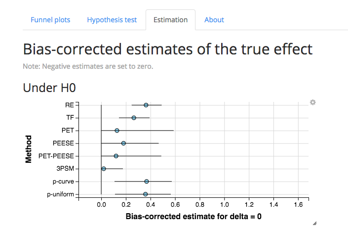

# meta-showdown

This Github repository has the fully reproducible simulation code for:

Carter, E. C., Schönbrodt, F. D., Hilgard, J., & Gervais, W. (2018). Correcting for bias in psychology: A comparison of meta-analytic methods. Retrieved from [https://osf.io/rf3ys/](https://osf.io/rf3ys/).

More material can be found in the associated [OSF project](https://osf.io/rf3ys/).

An [interactive Shiny app](http://shinyapps.org/apps/metaExplorer/) visualizes all results:

## General workflow for reproducing the analyses

- [0-start.R](0-start.R) loads all necessary packages and sources several files. This file should always be loaded first.
- [1-simFramework.R](1-simFramework.R) simulates all raw data files and stores them in /simParts. Each of the 432 conditions gets its own file with 1000 simulated meta-analyses.
- [2-analysisFramework.R](2-analysisFramework.R) grabs all simulated files from /simParts, runs all meta-analytical techniques on them, and stores the results as separate files under /analysisParts
- [3-resultsFramework.R](3-resultsFramework.R) loads the results of the meta-analyses from /analysisParts, aggregates them in a single file (see below: Documentation about the most relevant result files), adds some variables, and applies some filters, and computes summaries of the results (such as mean error, MSE, coverage, etc.). 

Additional folders:

- [helpers](helpers) contains some helper functions as well as some mostly unstructured supplementary analyses. These are not well documented.
- [Appendices](Appendices) contains the two appendices
- [MA-methods](MA-methods) contains all meta-analytical methods. All return their results in the same structured way. Please note that they have been implemented for two-group t-tests, and might or might not work for other types of tests.
- [sim-studies](sim-studies) contains the code for simulating the raw meta-analytical data with different true underlying effects, levels of QRP, etc.
- [oldStuff](oldStuff) The file [oldStuff/hilgard_result_table.R](oldStuff/hilgard_result_table.R) is helpful for breaking down the results into more readable parcels. Other old analyses are stored in this folder.

## Documentation about the most relevant result files

### Unaggregated data files (in /dataFiles)
- res.final.RData: This file contains the most fine-grained results of all meta-analytic (MA) techniques in long format; each row is one result of one MA technique for one simulated data set. No filters have been applied.
- res.wide.RData: This file contains the most fine-grained results of all meta-analytic (MA) techniques; each row is one MA technique for one simulated data set. No filters have been applied.
- res.wide.red.RData: A reduced version of res.wide. All further summaries have been computed based on this data set. One filter has been applied:
	- Ignore p-uniform when it doesn't provide a lower CI (very rare cases)
	
These files are too large for Github. You can generate them yourself by running [3-resultsFramework.R](3-resultsFramework.R). Be aware that doing so requires a lot of RAM!

### Aggregated data files (in /dataFiles)
- [summ.RData](dataFiles/summ.RData) / [summ.csv](dataFiles/summ.csv): This is the summary file which contains ME, RMSE, coverage, etc. for each method and each condition.

## Extending the analyses

We took a lot of care to simulate the meta-analyses in a way that they are plausible concerning QRPs, publication bias, samples sizes, etc. When new meta-analytical methods are developed, we encourage researchers to use these simulated files and conditions as sort of benchmark data to test their methods. This allows an easy comparison of the results.

[conditions.txt](simParts/conditions.txt) lists all 432 conditions with their parameter settings. That means, you can pick single conditions of interest.

## Version history:

0.2 (2018/02/01): tagged as "revision submitted to journal"

		> sessionInfo()
		R version 3.4.1 (2017-06-30)
		Platform: x86_64-apple-darwin15.6.0 (64-bit)
		Running under: macOS High Sierra 10.13.3

		Matrix products: default
		BLAS: /Library/Frameworks/R.framework/Versions/3.4/Resources/lib/libRblas.0.dylib
		LAPACK: /Library/Frameworks/R.framework/Versions/3.4/Resources/lib/libRlapack.dylib

		locale:
		[1] de_DE.UTF-8/de_DE.UTF-8/de_DE.UTF-8/C/de_DE.UTF-8/de_DE.UTF-8

		attached base packages:
		 [1] parallel  stats4    compiler  stats     graphics  grDevices utils     datasets  methods   base     

		other attached packages:
		 [1] bindrcpp_0.2        weightr_1.1.2       puniform_0.0.2      broom_0.4.2         notifyR_1.02        rjson_0.2.15        RCurl_1.95-4.8      bitops_1.0-6       
		 [9] progress_1.1.2      metafor_2.0-0       Matrix_1.2-11       meta_4.8-4          doMC_1.3.4          iterators_1.0.8     foreach_1.4.3       data.table_1.10.4-3
		[17] dplyr_0.7.4         reshape2_1.4.2      truncdist_1.0-2     evd_2.3-2           truncnorm_1.0-7     pwr_1.2-1           MASS_7.3-47        

		loaded via a namespace (and not attached):
		 [1] Rcpp_0.12.15      pillar_1.1.0      plyr_1.8.4        bindr_0.1         prettyunits_1.0.2 tools_3.4.1       tibble_1.4.2      nlme_3.1-131      lattice_0.20-35  
		[10] pkgconfig_2.0.1   rlang_0.1.6       psych_1.7.8       stringr_1.2.0     grid_3.4.1        glue_1.2.0        R6_2.2.2          foreign_0.8-69    purrr_0.2.4      
		[19] tidyr_0.7.2       magrittr_1.5      codetools_0.2-15  mnormt_1.5-5      assertthat_0.2.0  stringi_1.1.5    
    

0.1 (2017/05/20): tagged as "submitted to journal & preprint"

    > sessionInfo()
    R version 3.1.3 (2015-03-09)
    Platform: x86_64-suse-linux-gnu (64-bit)
    Running under: SUSE Linux Enterprise Server 11 SP4
    
    locale:
     [1] LC_CTYPE=en_US.UTF-8       LC_NUMERIC=C               LC_TIME=en_US.UTF-8        LC_COLLATE=en_US.UTF-8     LC_MONETARY=en_US.UTF-8   
     [6] LC_MESSAGES=en_US.UTF-8    LC_PAPER=en_US.UTF-8       LC_NAME=C                  LC_ADDRESS=C               LC_TELEPHONE=C            
    [11] LC_MEASUREMENT=en_US.UTF-8 LC_IDENTIFICATION=C       
    
    attached base packages:
     [1] parallel  stats4    compiler  stats     graphics  grDevices utils     datasets  methods   base     
    
    other attached packages:
     [1] puniform_0.0.2    rio_0.5.0         gtools_3.5.0      doParallel_1.0.10 broom_0.4.2       notifyR_1.02      rjson_0.2.15      RCurl_1.95-4.8   
     [9] bitops_1.0-6      progress_1.1.2    metafor_1.9-6     Matrix_1.2-7.1    meta_4.8-1        doMC_1.3.4        iterators_1.0.8   foreach_1.4.3    
    [17] data.table_1.10.4 dplyr_0.5.0       reshape2_1.4.1    truncdist_1.0-2   evd_2.3-2         truncnorm_1.0-7   pwr_1.2-1         MASS_7.3-47      
    
    loaded via a namespace (and not attached):
     [1] assertthat_0.2.0  chron_2.3-50      codetools_0.2-15  curl_2.6          DBI_0.6-1         devtools_1.13.0   digest_0.6.9      foreign_0.8-67   
     [9] git2r_0.18.0      grid_3.1.3        haven_1.0.0       httr_1.2.1        jsonlite_1.4      lattice_0.20-34   magrittr_1.5      memoise_1.1.0    
    [17] mnormt_1.5-5      nlme_3.1-128      openxlsx_3.0.0    plyr_1.8.4        prettyunits_1.0.2 psych_1.7.5       R6_2.2.1          Rcpp_0.12.10     
    [25] readODS_1.6.4     readxl_1.0.0      rstudioapi_0.6    stringi_1.0-1     stringr_1.2.0     tibble_1.3.0      tidyr_0.6.2       tools_3.1.3      
    [33] withr_1.0.2       XML_3.98-1.7   